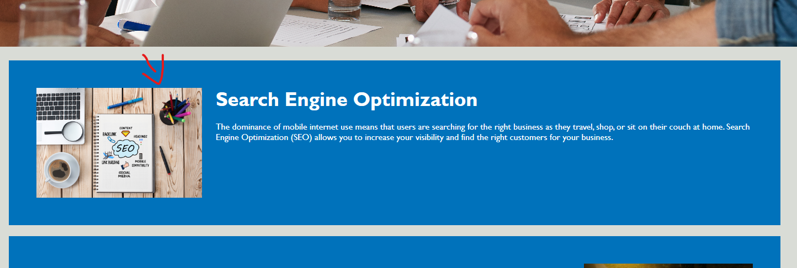

# Horiseon-Refactor

## Description

- My motivation for this project was solving the problems presented before me and enabling me to learn new methods of code.
- I worked on this project due to the existence of problematic code within the base website code.
- Through a few edits, I was able to make the website accesibility compliant to the best of my knowledge and the code semantic for future development.
- I learned many new tags through researching semantic tags and use cases. I also realized, sometimes it's best to tackle problems in short bursts as opposed to all at once.

## Installation

N/A

## Usage

The navigation bar links can be used to jump to relevant sections on the webpage.

**See below**

## Credits

I am not the original creator of the code used on the application. I only refactored it from the state given from the MSU Bootcamp curriculum.

Screenshot of full website provided by the MSU Bootcamp curriculum.

https://learntheweb.courses/topics/html-semantics-cheat-sheet/

https://websitesetup.org/wp-content/uploads/2016/10/wsu-css-cheat-sheet.pdf

## License

Please refer to the License in the repository.
